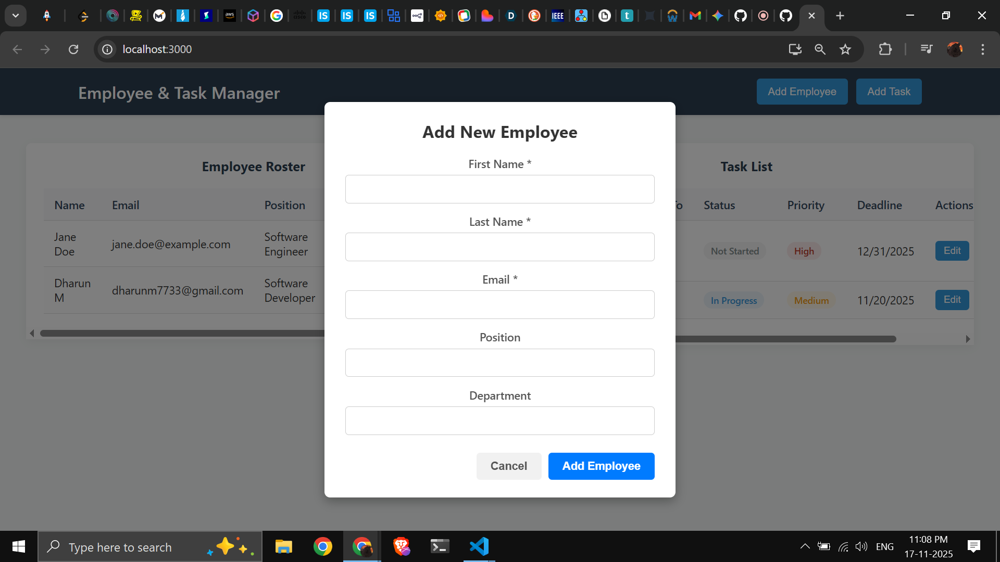
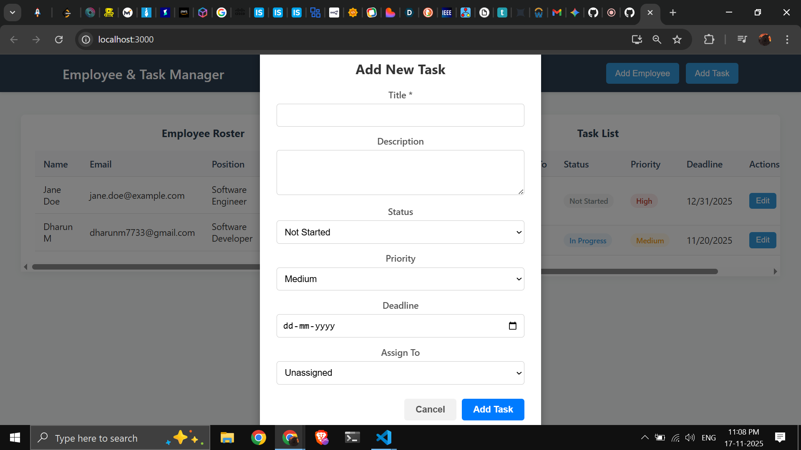

# Employee and Task Management System

This is a full-stack application built with the MERN stack (MongoDB, Express, React, Node.js). It provides a simple interface for managing a list of employees and assigning them specific tasks.

The project is built with a clean, decoupled architecture, featuring a complete RESTful API for the backend and a separate, component-based React application for the frontend.

### Screenshots

**

| Employee List View | Task List View |
| :---: | :---: |
|  |  |

### Technology Stack

| Area | Technology |
| :--- | :--- |
| **Frontend** | React, React Hooks |
| **Backend** | Node.js, Express.js |
| **Database** | MongoDB (with Mongoose) |
| **Styling** | Plain CSS, CSS Grid |
| **API** | RESTful principles |
| **Deployment** | Vercel (Frontend), Render (Backend), MongoDB Atlas (Database) |
| **Testing** | Thunder Client / Postman (for API endpoints) |

### Local Setup Instructions

To run this project on your local machine, you will need two separate terminals.

**Prerequisites:**
* Node.js (v18 or later)
* Git
* A free MongoDB Atlas account

#### 1. Clone the Repository

git clone [https://github.com/YOUR_USERNAME/YOUR_REPO_NAME.git](https://github.com/YOUR_USERNAME/YOUR_REPO_NAME.git)
cd employee-task-manager

### Local Setup Instructions

This project has two parts: the `project-backend` API and the `project-frontend` client. You must run both at the same time in two separate terminals.

#### 1. Run the Backend (The API)

1.  Navigate to the backend folder:
    ```bash
    cd project-backend
    ```
2.  Install all required packages:
    ```bash
    npm install
    ```
3.  **Important:** Create a file named `.env` in this folder. You will need to add your MongoDB Atlas connection string here. Your file should look like this:
    ```plaintext
    PORT=5001
    MONGO_URI=your-mongodb-atlas-string-goes-here
    ```
4.  Start the server:
    ```bash
    npm run dev
    ```
    *(The API should now be running on http://localhost:5001)*

#### 2. Run the Frontend (The App)

1.  Open a **new, separate terminal**.
2.  Navigate to the frontend folder:
    ```bash
    cd project-frontend
    ```
3.  Install all required packages:
    ```bash
    npm install
    ```
4.  Start the application:
    ```bash
    npm start
    ```
    *(The app should open automatically in your browser on http://localhost:3000)*

---

### Key Features

* **Full CRUD for Employees:** You can create, read, update, and delete employees.
* **Full CRUD for Tasks:** You can create, read, update, and delete tasks.
* **Linked Data:** The "Add Task" form populates a dropdown menu with all employees from the API, allowing you to assign a task to a real employee.
* **Clean UI:** Task status and priority are shown with colored badges for a clear, at-a-glance interface.
* **Responsive Design:** The layout automatically adjusts for smaller screens, ensuring the application is usable on a mobile device.
