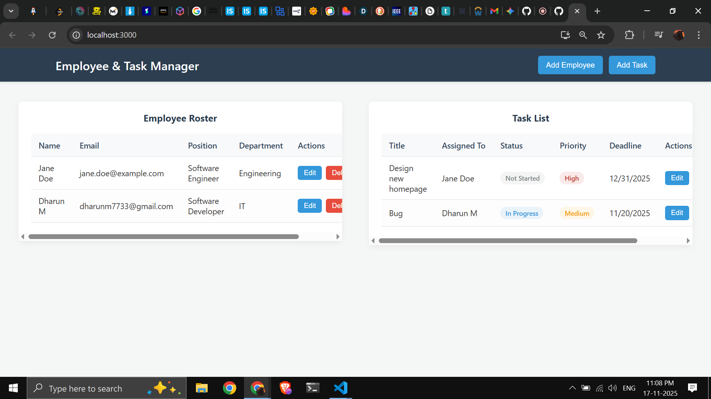

# Employee and Task Management System

This is a full-stack application built with the MERN stack (MongoDB, Express, React, Node.js). It provides a simple interface for managing a list of employees and assigning them specific tasks.

The project is built with a clean, decoupled architecture, featuring a complete RESTful API for the backend and a separate, component-based React application for the frontend.

### Live Demo Links

* **Frontend Application:** `https://YOUR_VERCEL_URL_HERE.vercel.app`
* **Backend API Endpoint:** `https://YOUR_RENDER_URL_HERE.onrender.com/api/tasks`

### Screenshots

**

| Employee List View | Task List View |
| :---: | :---: |
|  |  |

### Technology Stack

| Area | Technology |
| :--- | :--- |
| **Frontend** | React, React Hooks |
| **Backend** | Node.js, Express.js |
| **Database** | MongoDB (with Mongoose) |
| **Styling** | Plain CSS, CSS Grid |
| **API** | RESTful principles |
| **Deployment** | Vercel (Frontend), Render (Backend), MongoDB Atlas (Database) |
| **Testing** | Thunder Client / Postman (for API endpoints) |

### Local Setup Instructions

To run this project on your local machine, you will need two separate terminals.

**Prerequisites:**
* Node.js (v18 or later)
* Git
* A free MongoDB Atlas account

#### 1. Clone the Repository

```bash
git clone [https://github.com/YOUR_USERNAME/YOUR_REPO_NAME.git](https://github.com/YOUR_USERNAME/YOUR_REPO_NAME.git)
cd employee-task-manager
